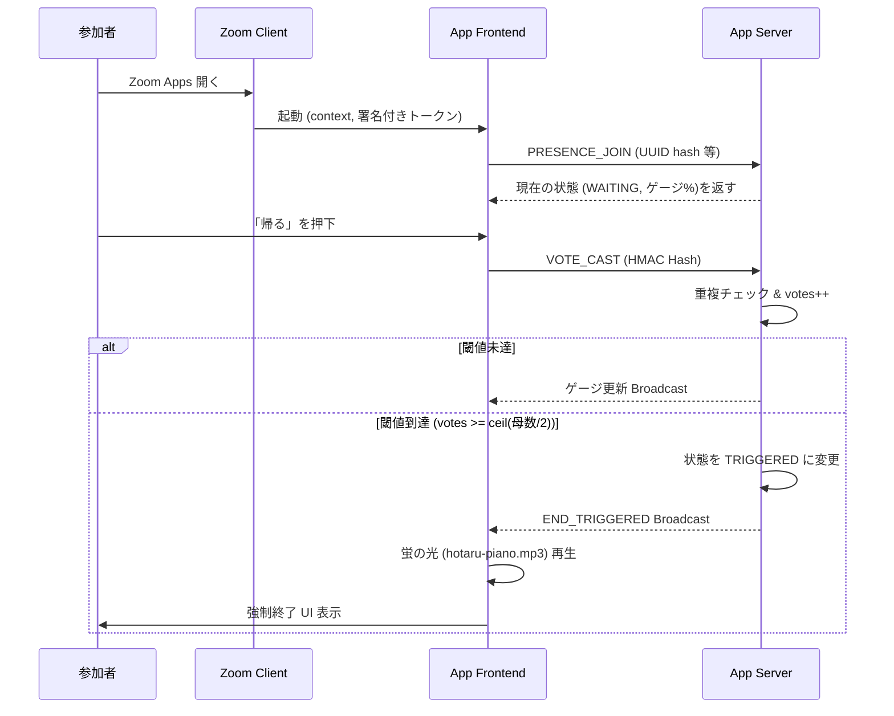

# 蛍の光ボタン (Hotaru End Button) - 要件定義書

## 1. プロダクト概要

### 1.1 プロダクト名
**蛍の光ボタン（Hotaru End Button）**
サブコンセプト：“半数が押したら、帰らなきゃいけない本能を呼び起こす”

### 1.2 目的
長引く会議を「誰かが言い出す」という心理的ハードルに依存せず、匿名の合意形成によって終わらせる。
「論理」ではなく、「文化的条件反射（蛍の光のメロディ）」で解散を駆動する。

### 1.3 提供価値（コアバリュー）
- 「帰らなきゃ……」というプレッシャーを個人の責任から切り離し、場の「空気」に委譲する。
- “解散の合図”を、押しボタンという身体的アクションと、強制力のある視覚・聴覚演出によって直撃させる。

---

## 2. スコープ

### 2.1 対象プラットフォーム
- 動作環境: Zoom クライアント内で動く Zoom Apps（公式 SDK）
- 参加形態: Zoom Meeting（※ブレイクアウトルームでの稼働は将来拡張とし、初期はメインルームのみを想定）

### 2.2 スコープIN
- 会議内で、参加者が各自で押せる「蛍の光ボタン」の提供
- 押下操作の**完全匿名化**
- 押下数が “母数の半数以上” に達した際の全体連動アクション：
  - 視覚・聴覚的な演出（画面フェードおよび「蛍の光」再生）の開始
  - “会議終了の合図”となる UI を全員に表示
  - （任意設定）ホストに対し「終了してください」という明示的・強制的通知の表示

### 2.3 スコープOUT（初期フェーズ）
- **Zoomミーティング自体の強制終了**: Zoomアプリとしての権限やSDK制約上、Meeting自体を終了させる操作はホストの手動操作に委ねる。
- **参加者の個人名・投票ログの保存**: 「匿名」という心理的安全性が本質であるため、一切保存しない。
- **Zoomミーティング音声への“注入”**: Web SDK等でのカスタム音声注入は制約が多いため、アプリ内（ブラウザコンテキスト内）での音声再生に留める。

---

## 3. 権限・制約前提（アーキテクチャ上の重要事項）

### 3.1 参加者一覧/人数取得の制約（Zoom Apps特有）
Zoom Apps SDKにおいて、参加者一覧（`getMeetingParticipants`）や `onParticipantChange` イベントは**ホストロール限定**となるケースが多い。つまり、一般参加者のクライアントからは正確な「Zoom上の総参加者数」を取得できない可能性がある。
**→ 解決策：「半数」の判定は“ホスト権限に依存しない”方式を基本とする。**

### 3.2 “半数”の定義とアプローチ
以下の2方式を設計し、初期リリースでは可用性の高い「方式A」を中心に成立させる。

- **方式A（推奨 / ホスト権限不要）**: 「会議に参加し、かつ『蛍の光ボタン』アプリを開いた人数」を母数とする。
  - 母数 = アプリに接続（WebSocket等でPresenceを確立）したユニーククライアント数
  - 閾値（半数） = `Math.ceil(母数 / 2)`
  - UX上の利点: 「アプリを開く＝押す気がある、帰る意思がある人たち」の合意形成となるため、ネタとしての親和性が高い。
- **方式B（ホスト権限が取れる場合のみのオプション）**:
  - SDKから「Zoom参加者総数」を取得し母数とする（ホストのアプリからのみ通知）。
  - 各参加者クライアントは見た目を変えず、サーバー側での閾値計算のみホストからの情報に依存する。

---

## 4. ユースケース

### 4.1 参加者（一般）
1. **アプリ起動**: 会議中、Zoom Apps から「蛍の光ボタン」を開く。
2. **ボタン押下**: 「帰りたい」タイミングでボタンを押す（※誰が押したかは完全に秘匿される）。
3. **進捗確認**: 「何%の人が押したか」を、“ぼかした表現” または “匿名ゲージ” として確認する。
4. **エンディング到達**: 閾値到達時、自動的に全員のアプリが「蛍の光モード」に遷移し、音楽と演出が始まる。

### 4.2 ホスト
1. **設定（任意）**: 閾値（デフォルト50%）を 60% や 2/3 などに変更可能。
2. **通知と行動**: 閾値到達による「蛍の光モード」発動時、ホスト固有の「会議を終了する」案内を受け取り、Zoomの標準機能から会議を終了させる。
3. **非常停止（任意）**: オプションで、演出を強制キャンセルする「非常停止ボタン」を利用可能（ネタの強要力を保つため、デフォルトはOFF推奨）。

---

## 5. 機能要件

### 5.1 投票機能（ボタン押下）
- **1人1回制限**: 参加者は1つの会議につき1回のみ投票可能。
- **完全匿名性**: 「誰が押したか」はサーバーログを含め特定不可能にする。
- **取り消し不可**: 一度押したボタンの取り消しは初期フェーズでは用意しない（覚悟の可視化）。
- **【実装要件：匿名性と1回制限の両立】**
  - クライアントはZoom Appから得られる `participant UUID` を取得。
  - サーバーへはID平文ではなく、`hash = HMAC(participantId, meetingSalt)` を送信。
  - サーバーはこの `hash` をKeyとして投票済みかを判定する。
  - `meetingSalt` は会議ごとに動的に生成され、会議終了と共に破棄されるため、事後の個人追跡は数学的に不可能となる。

### 5.2 母数（分母）カウント機能（方式A準拠）
- **Presence管理**: アプリ起動時にサーバーへ `PRESENCE_JOIN` を送信。
- **ハートビート**: 一定間隔（例: 30秒）で生存確認を行い、タイムアウト時や `PRESENCE_LEAVE` 時には母数から除外。

### 5.3 閾値判定
- **デフォルト閾値**: `50%`（半数以上）
- **判定ロジック**: `votes >= Math.ceil(denominator / 2)`
- 判定クリア時、サーバーは直ちに `END_TRIGGERED` イベントを全クライアントへブロードキャストする。

### 5.4 演出機能（蛍の光モード）
閾値到達（`END_TRIGGERED`）後、接続中の全クライアントで以下を**同時かつ強制的に**実行する。
1. **視覚演出**: 画面フェード（暗転 → 暖色灯のような表現 → 完全暗転など）。
2. **聴覚演出**: ループ仕様の「蛍の光」音源の再生（クライアントアプリ内での `Audio` 再生）。
   - *（※）指定音源: `hotaru-piano.mp3` を使用。*
3. **強制表示UI**: 「本日の営業は終了しました」「帰宅のお時間です」といった強制終了UIの表示。
4. **ホスト向け導線**: ホスト権限を持つユーザーにのみ「会議を終了してください」という強いCTA（Call to Action）を表示。

### 5.5 可視化とUI演出（進捗表示）
“誰が押したか分からない”を徹底するため、生数字（例：3/5人が押しました）は出さず、割合ゲージ（0〜100%）またはステータス文言で表現する。
- 0〜25%：「まだ早い」
- 26〜49%：「そろそろ…」
- 50%直前：「帰る準備」
- 50%到達（トリガー）：「帰宅」

---

## 6. 非機能要件

### 6.1 システム・セキュリティ・プライバシー
- **無保存の原則**: 氏名、メールアドレス、参加者ID平文は一切DB保存しない。
- **保存データ**: 会議の状態（Active/Ended）、`meetingSalt`、現在の母数（Int）、現在の投票数（Int）、投票済みハッシュリスト のみとするオンメモリ（または高頻度揮発のKVS/Redis等）管理。TTLは24時間以内に自動破棄。
- **通信レイテンシの担保**: 投票から進捗反映までは **1秒以内**。閾値到達から全員での演出開始は **2秒以内** を目標とし、WebSocket/Server-Sent Eventsなどを利用する。
- **認証・認可**: Zoom Apps標準のContext Headerや署名付きトークンを利用し、リクエストの正当性を担保する。

### 6.2 可用性
- 単一会議あたり **2〜200人** 程度の接続を許容できるスケーリング（初期は小〜中会議での利用を中心に、体験の最適化を図る）。

---

## 7. 画面・インターフェース仕様

### 7.1 メイン画面（投票受付中）
- **ヘッダー**: タイトル「蛍の光ボタン」
- **メインUI**: 巨大な「帰る」ボタン（赤色または警告色、押し心地のあるデザイン）
- **ステータス表示**:
  - 現在の進捗を示す匿名ゲージ（あるいは上記4段階のテキスト）
  - 注釈：「誰が押したかは分かりません」「半数が押すと蛍の光が流れます」

### 7.2 押下後の画面
- **ボタン状態**: 「帰る」ボタンは無効化（Disabled）または消滅。
- **メッセージ**: 「あなたの帰宅意思を受理しました」
- **ステータス表示**: 進捗ゲージのみを継続して表示。

### 7.3 蛍の光モード（エンディング画面）
- **画面全体**: 暗転ベース、ネオンや店舗閉店を思わせるリッチな演出。
- **メッセージ**: 「本日は終了しました。速やかにご退出ください。」
- **音声**: `hotaru-piano.mp3` の再生。
- **特権UI（ホストのみ）**: 「会議全体を終了する」という手順案内ボタン（Zoomの手動操作を促す）。

---

## 8. 状態遷移・シーケンス

### 8.1 サーバー状態モデル
- `WAITING`：投票受付中
- `TRIGGERED`：閾値到達 → 演出実行中
- `ENDED`：会議終了状態 または ホストによる明示的な終了処理後

### 8.2 イベント仕様
- `PRESENCE_JOIN`: クライアント接続（母数+1）
- `PRESENCE_LEAVE`: クライアント切断/タイムアウト（母数-1）
- `VOTE_CAST`: クライアントからの投票アクション。サーバー側でハッシュ照合→投票数+1
- `END_TRIGGERED`: サーバーが計算し、閾値を超えた場合に送信するブロードキャスト・イベント。
- `RESET`: （オプション）ホストのみが発火できる状態リセット。

### 8.3 シーケンス概略

---

## 9. エッジケースの対応

1. **アプリを開いていない参加者が多い場合**
   - 方式Aを採用するため、母数には含まれない。意図して開いた「帰る意思のある層（または面白がる層）」の中での半数となるため、プロダクトのネタとしての本質を損なわない。
2. **閾値到達直前の退出（母数変動）による意図せぬ発火**
   - 誰かが退出して母数が減り、結果的に `votes >= ceil(母数/2)` を満たしてしまうケース。
   - 対策：閾値判定ロジック実行時の母数は、意図せぬ連鎖発火を防ぐため緩やかに同期するか、または「投票」アクション起因のときのみ厳密に発火させる（※実装時に要調整）。
3. **音が鳴らない（ブラウザ/OSの自動再生ポリシー）**
   - Zoom Apps内のWebviewでもAuto Play制約がかかる場合がある。
   - 対策：アプリ起動時（または初回タップ時）にAudio Contextをユーザーインタラクションでアンロックしておくよう、フロントエンド実装でカバーする。音声不可の環境でも成立する強い**視覚演出**を担保する。

---

## 10. 受け入れテスト（Acceptance Criteria）

1. **母数と判定の正確性**
   - 5人がアプリ接続時、母数は5となること。2人の投票ではTRIGGERされず、3人目の投票で即座にTRIGGERされること（`ceil(5/2)=3`）。
2. **演出・状態遷移**
   - TRIGGER発火時、接続中の全員の画面が1〜2秒以内に「蛍の光モード」に遷移し、再生されること。
3. **匿名性と1回制限**
   - 同一参加者がクライアントをリロードしても再投票できないこと。
   - 別参加者が接続した際は問題なく投票できること。
4. **ライフサイクル**
   - Zoom会議終了後、その会議のレコード（salt、投票hashなど）がバックエンドからTTL等で完全に削除されること。
   - 途中退出したユーザーが母数から正確に引かれること（Presence離脱）。

以上
